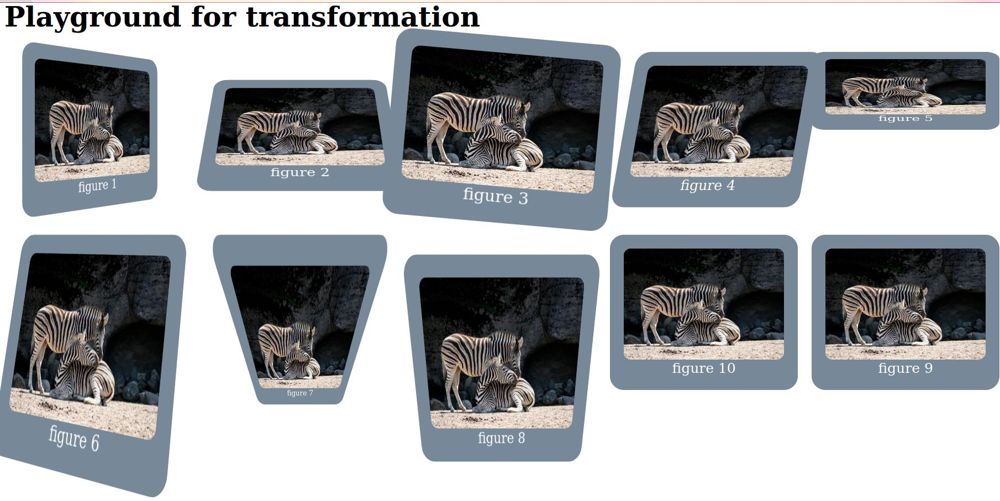

# CSS transform

see [transform-me.html](transform-me.html) as a starter code. Keep the initial CSS file from `starter.css` (grid setup etc.) and write your solution to `solution.css` to just focus on the important stuff.

---
## your task
try to recreate the look of the reference image by applying `transform` properties to the figure elements

```CSS
li:nth-child(1)>figure {
    /* style figure #1*/
}
```

--- 
### reference


---

### note

in some cases you need to change `transform-origin` too

## test your understanding

Why can't you split different transformations into style classes...

```CSS
.rotate45 { transform: rotateZ(45deg);}
.scale2 { transform: scale(2); }
.shiftright {transform: translateX(50px); }
```
...and apply them this way?

```HTML 
<section class="rotate45 scale2 shiftright">Style me!</section>
```

Write your answer as a comment into your `solution.css` file.